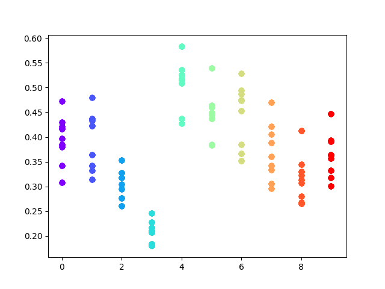
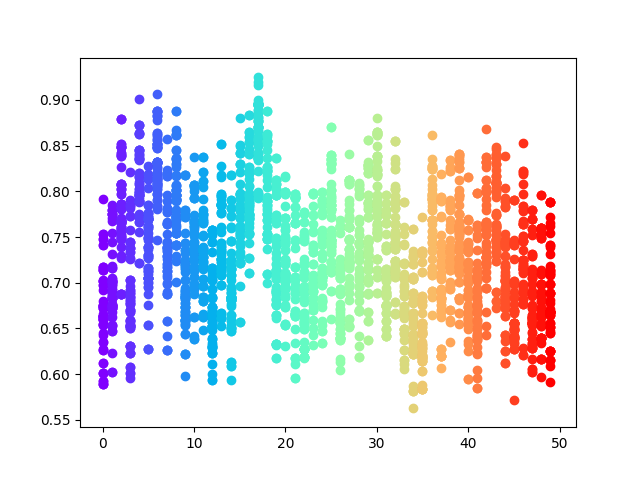
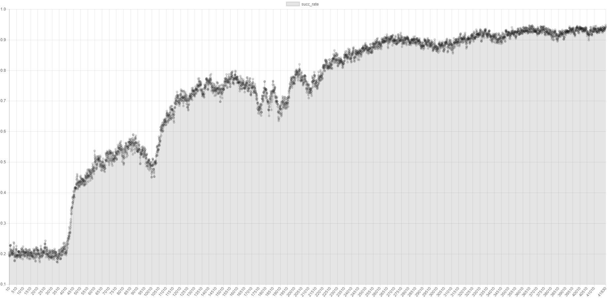

# Number Game
Number game is a simplifed version of Wittgenstein's referential game. 

This framework includes two players, a sender and a receiver. The target of the framework is to reach a consensus between two agents, about how to use a real number to denote an object.

## Game 1
In this game, the sender is given two n-dim one-hot vectors and a target(left/right): (vL, vR, t), t in {vL, vR}.

The sender need to send a real number to the receiver, we call this the sender's policy: s(vL, vR, t).

The receiver does not know the target, but sees the sender's value, the shuffled ont-hot vectors and tries to guess the target, we call this the receiver's policy r(vL', vR', s(vL, vR, t)) in {vL, vR}. (the vectors must be shuffled before sent to receiver because we need to prevent the situation that s(vL, vR, t) indicates whether to choose left or right).

If r(vL', vR', s(vL, vR, t)) = t, both players receive a payoff of 1, otherwise, they receive a payoff of 0.

# Algorithm
We adopt the same algorithm as the one in [Multi-Agent Cooperation and the Emergence of (Natural) Language](https://arxiv.org/pdf/1612.07182.pdf).

Note that the sender's policy is a real number, Deterministic Policy Gradient is required to learn the policy, in which we need the gradient of Q-function. To address this problem, we build an extra Critic network to fit the Q-function.

Small batch-size(32) is encouraged when training, large batch-size may make the training faster but results in the worse presentation.

## Extension
We could extend the number of vectors from 2 to k. 

The sender is given k n-dim vectors and a target, and the receiver tries to guess which one is the target.

# Result
## Real value representation of one-hot vectors

* n = 10, k = 2:

* n = 50, k = 2:

The value in x-axis indicates the index of one in the corresponding one-hot vector.

* n = 10, k = 5:

## Training curve

* n = 10, k = 5, batch = 32

